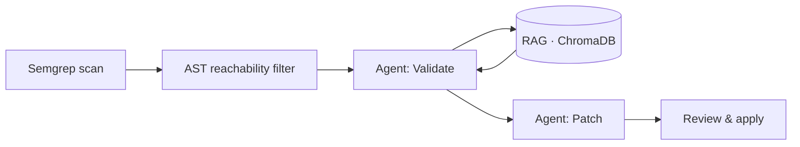

<!-- 

  
  
  

---

##  About Me

🎓 **T.Y EXTC Engineering Student** at **VJTI Mumbai**  
💻 **Full Stack Developer** passionate about creating seamless web experiences  
🤖 Currently exploring **AI Integration** in web applications  
🌐 Love building **interactive, responsive websites** that solve real problems  
☕ **Fun Fact:** I turn coffee into code!  

### What I'm Up To:
- 🔭 Working on AI-powered web applications
- 🌱 Learning advanced React patterns and AI integration
- 💡 Building projects that make a difference
- 🎯 Open to collaborating on innovative web projects

---

<h2 align="center">🔥 Tech Arsenal 🔥</h2>

  

### Frontend Magic ✨

### Backend Power ⚡

### Database Universe 🗄️

---

<h2 align="center">🚀 Featured Projects 🚀</h2>

### 🎓 Campus Event Management System
> **React** • **Tailwind CSS** • **Supabase**

A comprehensive platform designed to streamline campus event organization, registration, and management. Features real-time updates, user authentication, and an intuitive dashboard for event coordinators.

**Highlights:** 
- 🎯 Real-time event updates
- 👥 User authentication & authorization  
- 📊 Admin dashboard with analytics
- 📱 Fully responsive design

---

### 💰 Personal Finance Tracker
> **React** • **Tailwind CSS** • **MongoDB**

Smart money management application that helps users track expenses, set budgets, and visualize spending patterns through interactive charts and insights.

**Highlights:**
- 💳 Expense categorization
- 📈 Visual spending analytics
- 🎯 Budget goal setting
- 💾 Secure data storage

---

### 🤖 AI Timetable Generator
> **React** • **Tailwind CSS** • **FastAPI** • **DEAP** • **Supabase**

Intelligent scheduling system powered by genetic algorithms (DEAP) that generates optimal, conflict-free timetables for academic institutions automatically.

**Highlights:**
- 🧬 Genetic algorithm optimization
- ⚡ Automatic conflict resolution
- 📅 Multi-constraint scheduling
- 🎓 Academic calendar integration

---

<h2 align="center">📊 GitHub Analytics 📊</h2>

  
  

  
  

---

<h2 align="center">🏆 GitHub Trophies 🏆</h2>

  

---

<h2 align="center">💻 Coding Activity 💻</h2>

  

---

<h2 align="center">🐍 Watch the Snake Eat Contributions! 🐍</h2>

  

  <i>This snake is always hungry for code! 🍎</i>

---

<h2>🤝 Let's Connect & Collaborate! 🤝</h2>

 

### 💡 "First, solve the problem. Then, write the code." - John Johnson

 

 -->

# Karan Khedkar

### AI/ML Engineer · GenAI Developer · Full-Stack Engineer

I design systems that reason — agentic pipelines, RAG architectures, and the full-stack plumbing that gets them into production.
Currently studying Electronics & Telecommunication Engineering at **VJTI, Mumbai**.

 

## Currently

| | |
|---|---|
| **Focused on** | Agentic AI systems — multi-agent orchestration, tool-calling, and RAG grounding |
| **Exploring** | Retrieval architectures and evaluation for LLM-driven workflows |
| **Based in** | Mumbai, India |
| **Off-screen** | Usually mid-match on PC or PS5 |

 

## Featured Work

Three projects that best represent how I think — agentic systems, applied ML, and optimization.

 

<table>
<tr>
<td width="100%">

### [`CodeShield`](https://github.com/KaranKhedkar/CodeShield)
**Agentic AI security analysis platform**

A multi-agent pipeline that investigates and validates vulnerabilities on its own — rather than just flagging them and moving on.

- Static analysis (Semgrep) filtered through Tree-sitter AST reachability, so agents only spend reasoning on code paths that are actually exploitable
- A LangGraph agent graph on **GPT-OSS 120B** validates findings, kills false positives, and drafts remediation patches
- RAG layer over ChromaDB + Sentence-Transformers grounds every agent decision in real security-rule context, with Redis caching to keep the loop fast

`React` `FastAPI` `LangGraph` `Semgrep` `Tree-sitter` `ChromaDB` `Redis` `GPT-OSS 120B`

</td>
</tr>
</table>

<table>
<tr>
<td width="100%">

### [`FinSight AI`](https://github.com/KaranKhedkar/Bank-Statement-Analyzer)
**AI-powered financial analytics platform**

Turns raw, multi-format bank statements into forecasts and conversational insight.

- Ingestion pipeline auto-detects and parses statement formats across SBI, HDFC, ICICI, and other Indian banks
- Isolation Forest flags anomalous transactions; Prophet forecasts spending trends
- An agentic tool-calling layer maps natural-language questions to financial functions — powering what-if simulations and conversational charts, not just static dashboards

`React.js` `FastAPI` `Supabase` `PostgreSQL` `scikit-learn` `Prophet` `LangChain` `Gemini AI`

</td>
</tr>
</table>

<table>
<tr>
<td width="100%">

### [`NEP Timetable Generator`](https://github.com/KaranKhedkar/NEP_TIMETABLE)
**Constraint-driven timetable optimization**

Genetic-algorithm engine that solves NEP-compliant scheduling as an optimization problem rather than a manual chore.

- Fitness function jointly minimizes clashes, resource overload, and student idle time
- Full population-based pipeline — crossover, mutation, tournament selection — built with DEAP
- Cuts scheduling time by **95%+**, producing complete, conflict-free timetables in minutes

`React.js` `FastAPI` `Supabase` `PostgreSQL` `DEAP`

</td>
</tr>
</table>

 

## Also Built

<table>
<tr>
<td width="50%" valign="top">

**[Campus Event Management System](https://github.com/KaranKhedkar/Event_Management)**
Full-stack platform for organizing campus events end-to-end — role-based access for students, organizers, and admins, real-time updates, and an analytics dashboard.

`React` `Tailwind CSS` `Supabase`

</td>
<td width="50%" valign="top">

**[Personal Finance Tracker](https://github.com/KaranKhedkar/Personal-Finance-Tracker)**
Expense and budget tracker with categorization and interactive spending analytics, built on a MongoDB-backed full-stack foundation.

`React` `Tailwind CSS` `MongoDB`

</td>
</tr>
</table>

 

## Tech Stack

<table>
<tr>
<td valign="top" width="50%">

**Languages**
 

**AI / ML**
 

**GenAI**
 

</td>
<td valign="top" width="50%">

**Frontend / Backend**
 

**Databases / Storage**
 

**Tools**
 

</td>
</tr>
</table>

 

 

**[LinkedIn](https://linkedin.com/in/karan-khedkar) · [Email](mailto:karank200410@gmail.com)**

