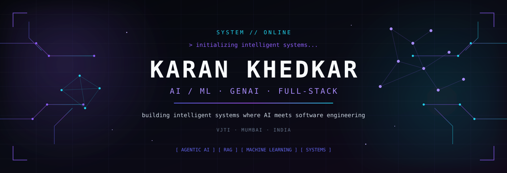
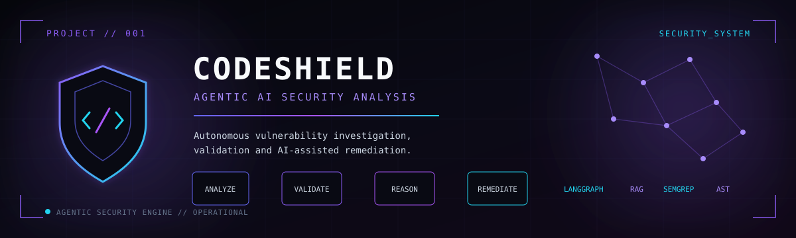
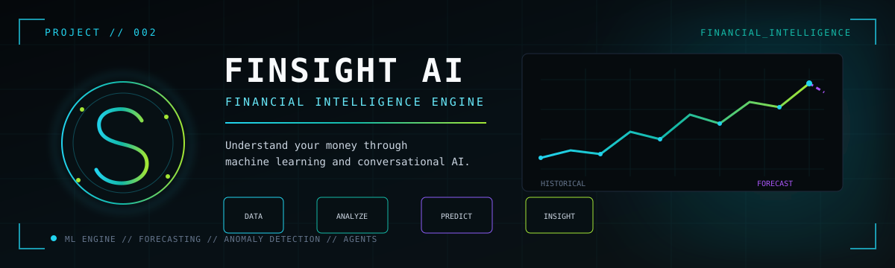
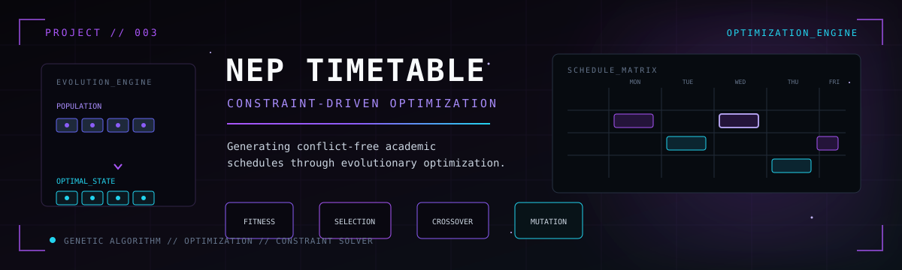
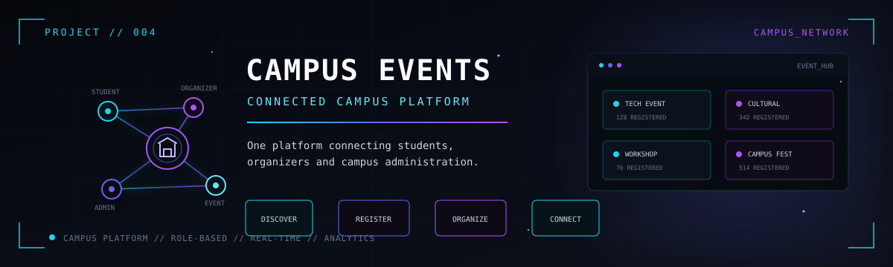
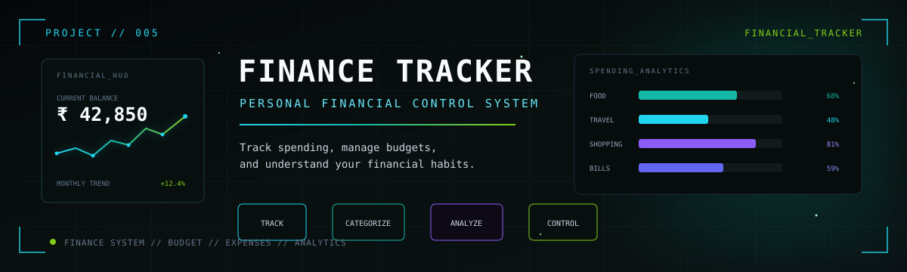
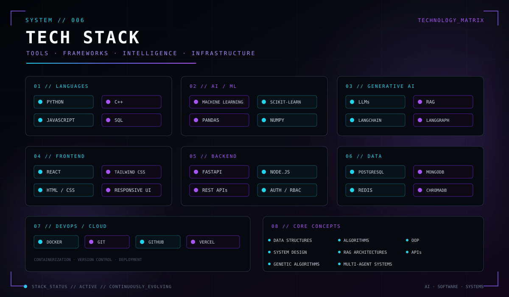
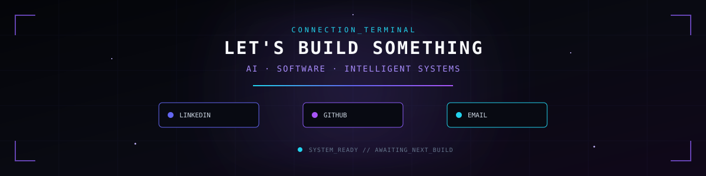

<!-- 

  
  
  

---

##  About Me

🎓 **T.Y EXTC Engineering Student** at **VJTI Mumbai**  
💻 **Full Stack Developer** passionate about creating seamless web experiences  
🤖 Currently exploring **AI Integration** in web applications  
🌐 Love building **interactive, responsive websites** that solve real problems  
☕ **Fun Fact:** I turn coffee into code!  

### What I'm Up To:
- 🔭 Working on AI-powered web applications
- 🌱 Learning advanced React patterns and AI integration
- 💡 Building projects that make a difference
- 🎯 Open to collaborating on innovative web projects

---

<h2 align="center">🔥 Tech Arsenal 🔥</h2>

  

### Frontend Magic ✨

### Backend Power ⚡

### Database Universe 🗄️

---

<h2 align="center">🚀 Featured Projects 🚀</h2>

### 🎓 Campus Event Management System
> **React** • **Tailwind CSS** • **Supabase**

A comprehensive platform designed to streamline campus event organization, registration, and management. Features real-time updates, user authentication, and an intuitive dashboard for event coordinators.

**Highlights:** 
- 🎯 Real-time event updates
- 👥 User authentication & authorization  
- 📊 Admin dashboard with analytics
- 📱 Fully responsive design

---

### 💰 Personal Finance Tracker
> **React** • **Tailwind CSS** • **MongoDB**

Smart money management application that helps users track expenses, set budgets, and visualize spending patterns through interactive charts and insights.

**Highlights:**
- 💳 Expense categorization
- 📈 Visual spending analytics
- 🎯 Budget goal setting
- 💾 Secure data storage

---

### 🤖 AI Timetable Generator
> **React** • **Tailwind CSS** • **FastAPI** • **DEAP** • **Supabase**

Intelligent scheduling system powered by genetic algorithms (DEAP) that generates optimal, conflict-free timetables for academic institutions automatically.

**Highlights:**
- 🧬 Genetic algorithm optimization
- ⚡ Automatic conflict resolution
- 📅 Multi-constraint scheduling
- 🎓 Academic calendar integration

---

<h2 align="center">📊 GitHub Analytics 📊</h2>

  
  

  
  

---

<h2 align="center">🏆 GitHub Trophies 🏆</h2>

  

---

<h2 align="center">💻 Coding Activity 💻</h2>

  

---

<h2 align="center">🐍 Watch the Snake Eat Contributions! 🐍</h2>

  

  <i>This snake is always hungry for code! 🍎</i>

---

<h2>🤝 Let's Connect & Collaborate! 🤝</h2>

 

### 💡 "First, solve the problem. Then, write the code." - John Johnson

 

 -->

<!-- =========================================================
     HERO
========================================================= -->

 

<!-- =========================================================
     INTRO
========================================================= -->

### `SYSTEM STATUS // ONLINE`

**AI / ML · GENAI · AGENTIC SYSTEMS · FULL-STACK**

 

Building intelligent systems where **AI meets software engineering**.

Exploring machine learning, generative AI, agentic architectures,
RAG systems, and scalable full-stack applications.

 
 

<!-- =========================================================
     CONNECT
========================================================= -->

 
 

<!-- =========================================================
     CURRENT MISSION
========================================================= -->

## `01 // CURRENT MISSION`

<table>
<tr>
<td width="33%" align="center">

### 🤖 AI SYSTEMS

Agentic AI  
RAG Pipelines  
LLM Applications  
Multi-Agent Workflows

</td>

<td width="33%" align="center">

### 🧠 MACHINE LEARNING

Predictive Models  
Anomaly Detection  
Optimization  
Data-driven Systems

</td>

<td width="33%" align="center">

### ⚙️ ENGINEERING

Full-Stack Systems  
REST APIs  
Databases  
Deployment & Infrastructure

</td>
</tr>
</table>

 
 

<!-- =========================================================
     FEATURED PROJECTS
========================================================= -->

## `02 // FEATURED SYSTEMS`

 

<!-- =========================================================
     PROJECT 001
========================================================= -->

### 🛡️ CodeShield — Agentic AI Security Analysis

An AI-powered security analysis system designed to investigate vulnerabilities, reason about their real-world impact, and assist with remediation.

**Core technologies**

`Python` `FastAPI` `React` `LangGraph` `RAG` `Semgrep` `Tree-sitter` `ChromaDB` `Redis`

**Key engineering concepts**

- Multi-agent vulnerability investigation
- Static analysis integration
- AST-based code analysis
- RAG-powered security reasoning
- Automated remediation assistance

**[ VIEW PROJECT → ](YOUR_CODESHIELD_REPO_URL)**

 

---

 

<!-- =========================================================
     PROJECT 002
========================================================= -->

### 💰 FinSight AI — Financial Intelligence Engine

An AI-powered financial analytics platform that combines transaction analysis, machine learning, forecasting, and conversational AI.

**Core technologies**

`React` `FastAPI` `PostgreSQL` `Python` `scikit-learn` `Prophet` `LangChain` `Gemini`

**Key engineering concepts**

- Financial data ingestion
- Transaction categorization
- Anomaly detection
- Expense forecasting
- AI-powered financial analysis
- Conversational what-if analysis

**[ VIEW PROJECT → ](YOUR_FINSIGHT_REPO_URL)**

 

---

 

<!-- =========================================================
     PROJECT 003
========================================================= -->

### 📅 NEP Timetable Generator — Genetic Optimization

A constraint-driven academic timetable generation system using a Genetic Algorithm to search for optimized schedules while minimizing conflicts.

**Core technologies**

`React` `FastAPI` `PostgreSQL` `Supabase` `DEAP` `Python`

**Key engineering concepts**

- Constraint-based fitness function
- Population-based optimization
- Selection
- Crossover
- Mutation
- Conflict minimization

**[ VIEW PROJECT → ](YOUR_TIMETABLE_REPO_URL)**

 

---

 

<!-- =========================================================
     PROJECT 004
========================================================= -->

### 🎓 Campus Event Management — Connected Campus Platform

A centralized platform designed to connect students, event organizers, and administrators through a unified campus event ecosystem.

**Core technologies**

`React` `Tailwind CSS` `Supabase`

**Key engineering concepts**

- Role-based access control
- Student registration
- Event creation and management
- Organizer workflows
- Administrative management
- Centralized event platform

**[ VIEW PROJECT → ](YOUR_CAMPUS_EVENTS_REPO_URL)**

 

---

 

<!-- =========================================================
     PROJECT 005
========================================================= -->

### 💸 Personal Finance Tracker — Financial Control System

A full-stack application for tracking expenses, managing budgets, categorizing spending, and visualizing personal financial activity.

**Core technologies**

`React` `Tailwind CSS` `MongoDB`

**Key engineering concepts**

- Expense management
- Budget tracking
- Transaction categorization
- Financial analytics
- Data visualization

**[ VIEW PROJECT → ](YOUR_FINANCE_TRACKER_REPO_URL)**

 
 

<!-- =========================================================
     TECHNOLOGY STACK
========================================================= -->

## `03 // TECHNOLOGY MATRIX`

 

 
 

<!-- =========================================================
     GITHUB
========================================================= -->

## `04 // GITHUB`

 

  

`BUILDING · EXPERIMENTING · LEARNING`

 
 

<!-- =========================================================
     FOOTER
========================================================= -->

 

`END OF TRANSMISSION`

